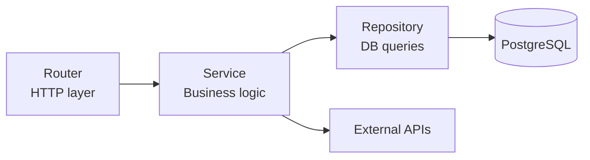
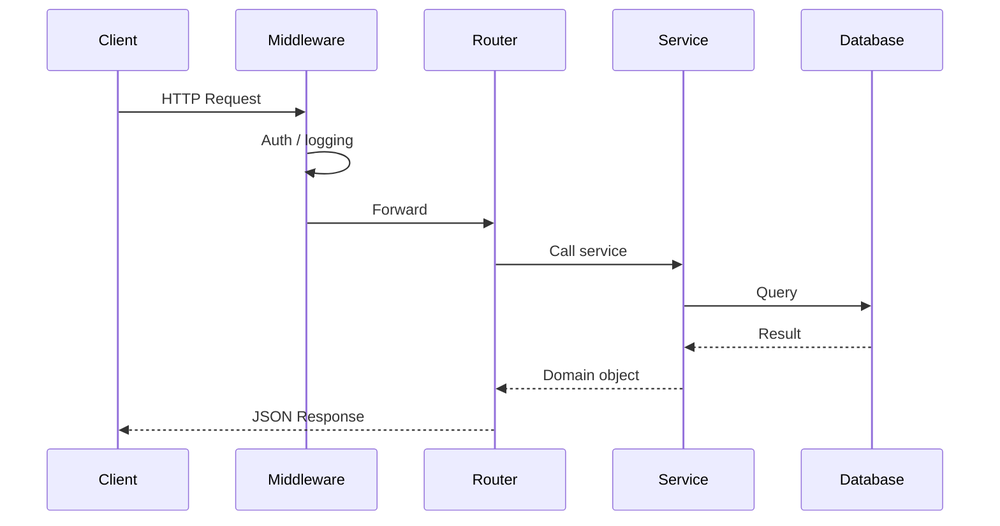

# FastAPI Patterns I Actually Use

After building several production APIs with FastAPI, these are the patterns that stuck.

## Dependency injection for DB sessions

Don't open sessions manually in each route. Use a dependency.

```python
from sqlalchemy.ext.asyncio import AsyncSession
from app.database import async_session_factory

async def get_db() -> AsyncGenerator[AsyncSession, None]:
    async with async_session_factory() as session:
        try:
            yield session
            await session.commit()
        except Exception:
            await session.rollback()
            raise

# In routes:
@router.get("/users/{user_id}")
async def get_user(user_id: int, db: AsyncSession = Depends(get_db)):
    ...
```

## Layered architecture



Keep routers thin — they just parse HTTP and call services. Services own the logic. Repositories own the SQL.

## Background tasks for fire-and-forget

```python
from fastapi import BackgroundTasks

def send_welcome_email(email: str):
    # runs after response is sent
    email_client.send(to=email, template="welcome")

@router.post("/users")
async def create_user(
    data: UserCreate,
    background_tasks: BackgroundTasks,
    db: AsyncSession = Depends(get_db),
):
    user = await user_service.create(db, data)
    background_tasks.add_task(send_welcome_email, user.email)
    return user
```

For anything heavier (retries, queues), use Celery or ARQ instead.

## Custom exception handlers

```python
class NotFoundError(Exception):
    def __init__(self, resource: str, id: int):
        self.resource = resource
        self.id = id

@app.exception_handler(NotFoundError)
async def not_found_handler(request: Request, exc: NotFoundError):
    return JSONResponse(
        status_code=404,
        content={"error": f"{exc.resource} {exc.id} not found"},
    )
```

## Request/response lifecycle



## Settings with pydantic-settings

```python
from pydantic_settings import BaseSettings

class Settings(BaseSettings):
    database_url: str
    secret_key: str
    debug: bool = False
    allowed_origins: list[str] = []

    class Config:
        env_file = ".env"

settings = Settings()
```

One settings object, loaded once at startup. No `os.environ.get()` scattered everywhere.
