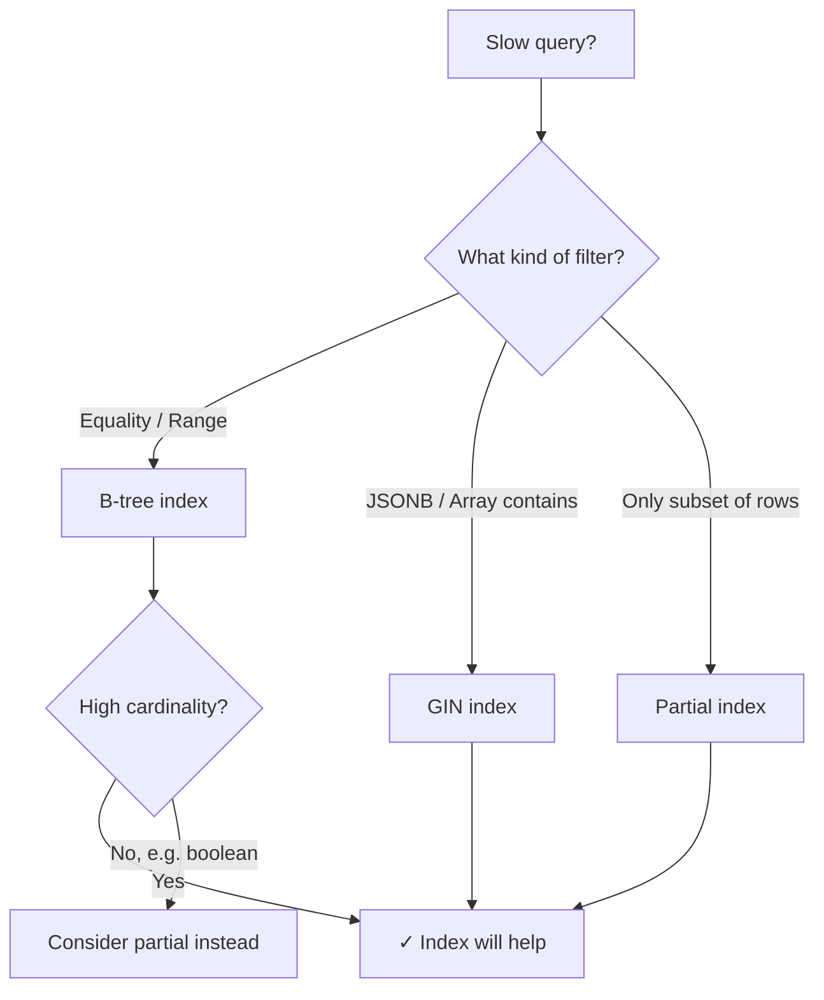

# PostgreSQL Indexing Strategies

Indexes are one of the highest-leverage tools in backend engineering. A single well-placed index can turn a 10-second query into a 5ms one. Here are the patterns I keep coming back to.

## The basics: B-tree

The default. Good for equality and range queries.

```sql
-- Simple index on a foreign key (almost always worth it)
CREATE INDEX idx_orders_user_id ON orders(user_id);

-- Composite index — column order matters
-- This helps: WHERE status = 'active' AND created_at > '2024-01-01'
-- This doesn't: WHERE created_at > '2024-01-01' (alone)
CREATE INDEX idx_orders_status_created ON orders(status, created_at DESC);
```

## Partial indexes

Index only the rows you actually query. Smaller, faster.

```sql
-- Only index active users — if 95% are inactive, this is huge
CREATE INDEX idx_users_active ON users(email) WHERE is_active = true;

-- Only recent unprocessed jobs
CREATE INDEX idx_jobs_pending ON jobs(created_at)
WHERE status = 'pending';
```

## GIN indexes for JSONB and arrays

```sql
-- Full JSONB column
CREATE INDEX idx_events_payload ON events USING GIN(payload);

-- Specific key path (much smaller)
CREATE INDEX idx_events_type ON events USING GIN((payload -> 'type'));
```

## How to verify an index is being used

```sql
EXPLAIN (ANALYZE, BUFFERS)
SELECT * FROM orders
WHERE user_id = 42 AND status = 'completed'
ORDER BY created_at DESC
LIMIT 10;
```

Look for `Index Scan` vs `Seq Scan`. Also check `Buffers: shared hit` — cache hits are free, reads are expensive.

## Decision flowchart



## Rules of thumb

- **Always index foreign keys.** Postgres doesn't do this automatically.
- **Composite index column order:** most selective first, or match your `WHERE` clause order.
- **Don't over-index writes.** Every index slows down `INSERT`/`UPDATE`/`DELETE`.
- **`pg_stat_user_indexes`** tells you which indexes are never used — drop them.

```sql
-- Find unused indexes
SELECT schemaname, tablename, indexname, idx_scan
FROM pg_stat_user_indexes
WHERE idx_scan = 0
ORDER BY schemaname, tablename;
```
